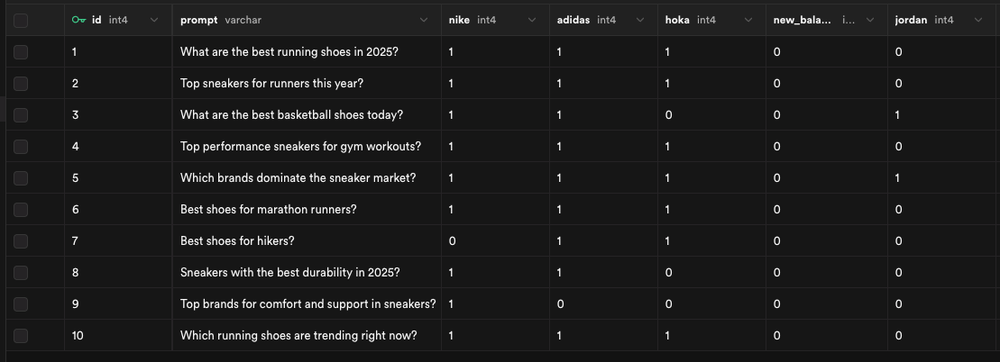
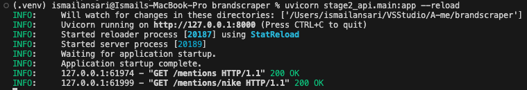

## 🟩 Stage 1: Web Scraping

### Overview

This simulates querying ChatGPT with sportswear-related prompts and finds how often specific brands are mentioned. Due to limitations with automating the ChatGPT web UI (authentication, Cloudflare), prompts were manually submitted and responses were stored in a structured format for parsing.

---

### Setup

1. **Clone the repository:**
   ```bash
   git clone https://github.com/<your-username>/brandscraper.git
   cd brandscraper
   ```

2. **Create and activate a virtual environment:**
   ```bash
   python -m venv .venv
   source .venv/bin/activate
   ```

3. **Install required packages:**
   ```bash
   pip install -r requirements.txt
   ```

4. **Review the data files:**
   - `stage1_scraper/prompts.json`: List of 10 prompts
   - `stage1_scraper/raw_outputs.json`: ChatGPT responses (manually copied)

---

### Running Stage 1

#### 1: Simulate Prompt Responses
Due to restrictions on scraping ChatGPT directly, the 10 prompts in `prompts.json` were submitted manually to ChatGPT. The responses were then copied into `raw_outputs.json` as an array of JSON objects, example:

```json
[
  {
    "prompt": "What are the best running shoes in 2025?",
    "response": "Nike ZoomX Vaporfly 4%, Adidas Adizero, and Hoka Clifton 10 are among the top running shoes of 2025..."
  },
  ...
]
```

#### 2: Count Brand Mentions
Run the this to extract how often each brand is mentioned in the responses:

```bash
python stage1_scraper/parser.py
```

This will generate two output files:
- `results.json`: JSON with brand counts per prompt
- `results.csv`: Same data in CSV format

---

### 📊 Example Output

**results.json**
```json
[
  {
    "prompt": "What are the best running shoes in 2025?",
    "Nike": 2,
    "Adidas": 1,
    "Hoka": 1,
    "New Balance": 0,
    "Jordan": 0
  }
]
```

**results.csv**
```csv
prompt,Nike,Adidas,Hoka,New Balance,Jordan
What are the best running shoes in 2025?,2,1,1,0,0
```

---

### 💡 Suggestions for Improvement

- Automate prompt submission using Playwright if login/session management is solved
- Use NLP models (e.g., spaCy) for more flexible brand recognition including other brand names under the same brand
- Store responses with timestamps to track brand trends over time
- Add UI for prompt input and visualization dashboard


## 🟦 Stage 2: Mentions API

### Overview

This stage shows the brand mention metrics collected in Stage 1 through a lightweight API. It uses FastAPI as the web framework and Supabase (PostgreSQL) as the backend database.

Two endpoints are implemented:
- `GET /mentions` — returns total mentions of all brands
- `GET /mentions/{brand}` — returns total mentions for a specific brand

---

### Setup

1. **Install dependencies**
   ```bash
   pip install -r requirements.txt
   ```

2. **Set up environment variables**
   Create a `.env` file in the `stage2_api/` directory and add your Supabase DB connection string:

   ```
   DB_URL=postgresql://postgres:<your-password>@<your-project-ref>.supabase.co:5432/postgres
   ```

3. **Create the database table (run once in Supabase SQL Editor)**
   ```sql
   create table prompt_results (
     id serial primary key,
     prompt text,
     nike int,
     adidas int,
     hoka int,
     new_balance int,
     jordan int
   );
   ```

4. **Seed the database with parsed results:**
   Make sure `results.csv` exists inside `stage1_scraper/`, then run:

   ```bash
   python -m stage2_api.seed_data
   ```

---

### Sample Data in Supabase



### Run API Server

From the project root (`brandscraper/`), start the server with:

```bash
uvicorn stage2_api.main:app --reload
```

The API will be live at:
[http://127.0.0.1:8000](http://127.0.0.1:8000)

Interactive docs:
[http://127.0.0.1:8000/docs](http://127.0.0.1:8000/docs)

---

### Endpoints

#### `GET /mentions`
Returns the total number of mentions for each brand across all prompts.

**Example Response:**
```json
{
  "nike": 9,
  "adidas": 9,
  "hoka": 8,
  "new_balance": 0,
  "jordan": 2
}
```

---

#### `GET /mentions/{brand}`
Returns the total mentions for a specific brand.

**Example Request:**
```
GET /mentions/nike
```

**Response:**
```json
{
  "nike": 9
}
```

If an invalid brand is requested (e.g., `/mentions/puma`), it will return:
```json
{
  "detail": "Brand not found"
}
```
### API Response: GET /mentions


---

### 💡 Suggestions for Improvement

- Add time-series tracking for brand mentions
- Build a dashboard frontend using React
- Add keyword similarity (example: match “NB” with “New Balance”)
- Enable input of custom prompts and real-time scoring